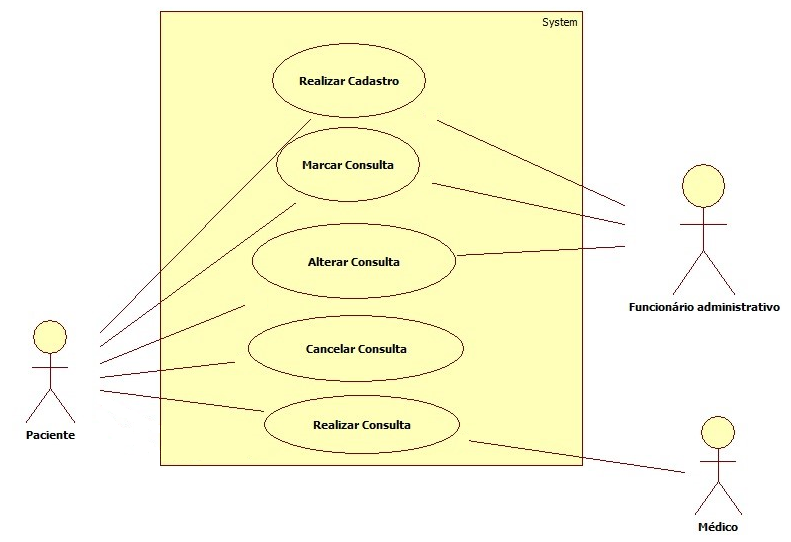

# Casos de uso

## 1. Diagrama de casos de uso

**Instruções do professor**: Insira abaixo o diagrama com os casos de uso do seu sistema. A imagem abaixo é somente um exemplo.

## 2. Especificação dos casos de uso

**Instruções do professor**: Para cada caso de uso, criar as tabelas com a especificação do caso de uso. Siga o exemplo dado abaixo:

### 2.1. Caso de uso **REALIZAR CADASTRO**

| Campo          | Informação        |
|---|---|
| Identificador: | UC01              |
| Nome:          | Realizar Cadastro |
| Atores:        | Funcionário administrativo |
| Sumário:       | Permite que o funcionário administrativo inclua, altere, exclua ou consulte os dados do cadastro. |

| Fluxo Principal |
|---|
|1.	Selecionar a opção Realizar Cadastro|	
|2.	O sistema apresenta uma lista com todos os campos a serem preenchidos.|
|3.	O sistema apresenta opções de Incluir (FA1), Alterar (FA2), Excluir (FA3) ou Consultar (FA4).|
|4.	Seleciona a opção desejada.|	

|Fluxo Alternativo 1 (FA1) – Incluir Cadastro|
|---|
|Ações do Ator	Ações do Sistema|
|1.Seleciona a opção Incluir Cadastro| 	
|2. O sistema apresenta os dados para serem cadastrados| 
|3.  Preenche os dados| 	
|4.Seleciona a opção Salvar|	
|5.Salva os dados do novo paciente ou funcionário| 

|Fluxo Alternativo 2 (FA2) – Alterar Cadastro|
|---|
|Ações do Ator	Ações do Sistema|
|1.Seleciona o Cadastro|	
|2. O sistema apresenta os dados do cadastro para alteração| 
|3.  Altera os dados do cadastro|	
|4.Seleciona a opção Confirma Alteração|	
|5.Atualiza os dados do cadastro do paciente ou funcionário|

|Fluxo Alternativo 3 (FA3) – Excluir Cadastro|
|---|
|Ações do Ator	Ações do Sistema|
|1.Seleciona Cadastro 	|
|2. O sistema apresenta os dados do cadastro que será excluída|
|3. Solicita confirmação de exclusão.|
|4.Confirma Exclusão	|
|5.Exclui o cadastro|

|Fluxo Alternativo 4 (FA4) – Consultar Cadastro|
|---|
|Ações do Ator	Ações do Sistema|
|1.Seleciona o Cadastro 	|
|2. O sistema apresenta os dados do cadastro|

| Campo          | Informação        |
|---|---|
| Identificador: | UC02              |
| Nome:          | Marcar Consulta |
| Atores:        | Funcionário administrativo |
| Sumário:       | Permite que o funcionário administrativo inclua, altere, exclua ou consulte os dados da consulta. |

|Fluxo Alternativo 1 (FA1) – Marcar Consulta|
|---|
|Ações do Ator	Ações do Sistema|
|1.Seleciona a opção Marcar Consulta| 	
|2. O sistema apresenta os dados para serem cadastrados| 
|3.  Preenche os dados| 	
|4.Seleciona a opção Salvar|	
|5.Salva os dados da nova consulta| 

|Fluxo Alternativo 2 (FA2) – Alterar Consulta|
|---|
|Ações do Ator	Ações do Sistema|
|1.Seleciona o Consulta|	
|2. O sistema apresenta os dados do Consulta para alteração| 
|3.  Altera os dados do Consulta|	
|4.Seleciona a opção Confirma Alteração|	
|5.Atualiza os dados da Consulta do paciente |

|Fluxo Alternativo 3 (FA3) – Excluir Consulta|
|---|
|Ações do Ator	Ações do Sistema|
|1.Seleciona Consulta 	|
|2. O sistema apresenta os dados do Consulta que será excluída|
|3. Solicita confirmação de exclusão.|
|4.Confirma Exclusão	|
|5.Exclui o Consulta|

|Fluxo Alternativo 4 (FA4) – Consultar Consulta|
|---|
|Ações do Ator	Ações do Sistema|
|1.Seleciona o Consulta 	|
|2. O sistema apresenta os dados do Consulta|

### 2.2. Caso de uso **MARCAR CONSULTA**

| Campo          | Informação        |
|---|---|
| Identificador: | UC02              |
| Nome:          | Marcar Consulta |
| Atores:        | Funcionário administrativo |
| Sumário:       | Este caso de uso permite que o funcionário inclua, altere, exclua ou consulte os dados referente a consulta|

|Fluxo Principal|
|---|
|Ações do Ator	Ações do Sistema|
|1. Selecionar a opção Marcar Consulta|	
|2. O sistema apresenta uma lista com todos os requisitos da consulta.|
|3. O sistema apresenta opções de Incluir (FA1), Alterar (FA2), Excluir (FA3) ou Consultar (FA4).|
|4. Seleciona a opção desejada.	|

|Fluxo Alternativo 1 (FA1) – Incluir Consulta|
|---|
|Ações do Ator	Ações do Sistema|
|1. Seleciona a opção Incluir Consulta|	
|2. O sistema apresenta os dados a serem registrados.|
|3. Preenche os dados |	
|4. Seleciona a opção Salvar|	
|5. Salva os dados da consulta|

|Fluxo Alternativo 2 (FA2) – Alterar Consulta|
|---|
|Ações do Ator Ações do Sistema|
|1. Seleciona o Consulta|	
|2. O sistema apresenta os dados da consulta para alteração |
|3. Altera os dados da Consulta	|
|4. Seleciona a opção Confirmar Alteração|	
|5. Atualiza os dados da consulta|

|Fluxo Alternativo 3 (FA3) – Excluir Consulta|
|---|
|Ações do Ator Ações do Sistema|
|1. Seleciona o Consulta |	
|2. O sistema apresenta a consulta que será excluída|
|3. Solicita confirmação de exclusão|
|4. Confirma Exclusão	|
|5. Exclui a consulta|

|Fluxo Alternativo 4 (FA4) – Consultar|
|---|
|Ações do Ator	Ações do Sistema|
|1.Seleciona a Consulta|	
|2. O sistema apresenta os dados da consulta|

### 2.3. Caso de uso **ALTERAR CONSULTA**

| Campo          | Informação        |
|---|---|
| Identificador: | UC03              |
| Nome:          | Alterar Consulta |
| Atores:        | Paciente |
| Sumário:       | Este caso de uso permite que o paciente solicite alteração de consulta|

|Fluxo Principal|
|---|
|Ações do Ator	Ações do Sistema|
|1.Selecionar a opção Alterar Consulta|	
|2.O sistema apresenta uma lista com todas as consultas do paciente.|
|3.O sistema apresenta opções de Alterar (FA2) ou Consultar (FA4).|
|4.Seleciona a opção desejada.	|

|Fluxo Alternativo 2 (FA2) – Alterar Consulta|
|---|
|Ações do Ator	Ações do Sistema|
|1. Seleciona a Consulta	|
|2. O sistema apresenta os dados da consulta para alteração 
|3. Altera os dados da consulta|	
|4. Seleciona a opção Confirmar Alteração|	
|5. Atualiza os dados do paciente|

|Fluxo Alternativo 3 (FA3) – Consultar Candidato|
|---|
|Ações do Ator	Ações do Sistema|
|1. Seleciona a consulta|	
|2. O sistema apresenta os dados da consulta|

	

### 2.4. Caso de uso **CANCELAR CONSULTA**

| Campo          | Informação        |
|---|---|
| Identificador: | UC04              |
| Nome:          | Cancelar Consulta |
| Atores:        | Paciente |
| Sumário:       | Permite que o paciente realize o cancelamento da consulta|

|Fluxo Principal|
|---|
|Ações do Ator	Ações do Sistema|
|1.	Selecionar a opção Cancelar Consulta	|
|2.	O sistema apresenta uma lista com todas as consultas.
|3.	O sistema apresenta opções de Excluir (FA3).|
|4.	Seleciona a opção desejada.|	

|Fluxo Alternativo 3 (FA3) – Excluir Consulta|
|---|
|Ações do Ator	Ações do Sistema|
|1.Seleciona a Consulta	|
|2. O sistema apresenta os dados da Consulta que será excluído|
|3. Solicita confirmação de exclusão|
|4.Confirma Exclusão	|
|5.Exclui a Consulta|

### 2.5. Caso de uso **REALIZAR CONSULTA**

| Campo          | Informação        |
|---|---|
| Identificador: | UC05              |
| Nome:          | Realizar Consulta |
| Atores:        | Médico|
| Sumário:       | Permite que o médico registre os dados referente a consulta realizada|

|Fluxo Principal|
|---|
|Ações do Ator	Ações do Sistema|
|9.	Selecionar a opção Realizar Consulta	|
|	10.	O sistema apresenta uma lista com todos pacientes do dia.|
|	11.	O sistema apresenta opções de Incluir (FA1), Alterar (FA2), Excluir (FA3) ou Consultar (FA4).|
|12.	Seleciona a opção desejada.	|

|Fluxo Alternativo 1 (FA1) – Incluir Registro|
|---|
|Ações do Ator	Ações do Sistema|
|1.Seleciona a opção Incluir Registro	|
|	2. O sistema apresenta os dados para serem cadastrados |
|3.  Preenche os dados 	|
|4.Seleciona a opção Salvar	|
|	5.Salva os dados do novo registro|

|Fluxo Alternativo 2 (FA2) – Alterar Registro|
|---|
|Ações do Ator	Ações do Sistema|
|1.Seleciona o Registro	|
|	2. O sistema apresenta os dados do registro para alteração |
|3.  Altera os dados do registro	|
|4.Seleciona a opção Confirmar Alteração	|
|	5.Atualiza os dados do registro|

|Fluxo Alternativo 3 (FA3) – Excluir Registro|
|---|
|Ações do Ator	Ações do Sistema|
|1.Seleciona o Registro	|
|	2. O sistema apresenta os dados do registro que será excluído|
|	3. Solicita confirmação de exclusão|
|4.Confirma Exclusão	|
|	5.Exclui o registro|

|Fluxo Alternativo 4 (FA4) – Consultar Registro|
|---|
|Ações do Ator	Ações do Sistema|
|1.Seleciona o Registro	|
|	2. O sistema apresenta os dados do Registro|

**Instruções do professor**: As tabelas acima mostram um exemplo de especificação de **um único caso de uso**. Lembre-se de especificar cada um dos casos de uso.

